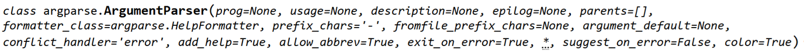

## argpasr是內建的module,裡面含有
- 內建class(例如:ArgumentParser)
- function
- 常數
  
## parser = argparse.ArgumentParser(description="猜數字遊戲")
- (description="猜數字遊戲") 是_init_(self) 初始化initial 
- 
- 參數(description)有default值,所以在使用的時候可有可無,引述名稱可以是空的
- 在設定參數時就是引述名稱的呼叫
- parser就是由ArgumentParser產生的實體,一般用parser:ArgumentParser表示

## paser(實體)裡面有
- 實體屬性
- 實體方法(例:add_argument) == parser.add_argument
